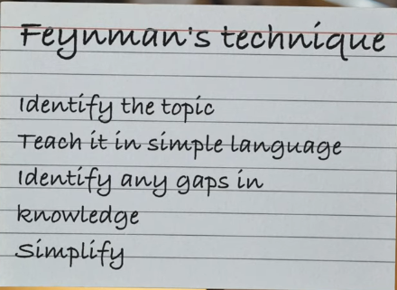
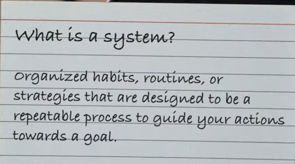

## How to be disciplined without burn out

You feel the most resistance when you're trying to start a task than to carry on with one.

1. Have a pre-focus routine
   Like warm up before lifting heavy

2. Have tunnel vision on the task you're working on. Avoid multi tasking
   Give yourself time to write the most important things to get done. Then start doing them in a prioritized way.

3. Have a low threshold for effort.
   Bring the task you need to get done to the simplest actionable step that you have the effort/willingness to do.
   Then move ahead from that.

4. Two day rule. You can skip a day but you have to ensure you go the next. Never skip more than two days.

5. Deeply understand your reasons for actions in every field. Why and what will happen if you don't do that.

Why guitar  
Why singing  
Why badminton  
Why gym  
Why self improvement  
Why study

---

## Studying techniques:

### > three branches only

Keep shit simple, use three blocks to study any topic  
Memorising, Applying, Revising  
rinse and repeat

---

## To study complex topics:

To prepare for exams, prepare with questions not revision of shit notes.  
Doing > lol

---

To improve extensively, reflect on study sessions and methods used.  
Try to find flaws and pros from each interaction and look to improve and implement better methods.

---

Focus on building portfolio, not just grades. Grades don't differentiate you.

## things to guarantee academic success

> foot in the door, try connecting with professors to get any small projects early on that can expand into something more later on.

> experiment with different systems of goal pursuit, get ahead. have the right systems organised.

> find your resources online to learn. fkn free and good.

> find right guidance. ask students who are experienced about the shit you're going through because they've most probably had the same experience

---

# Learning resources:

|      | Math                                                                                             | Comp1              | Comp2                                                                                             | Chemistry                                                                                                                                                           | Physics                                                                                                         | Business |
| ---- | ------------------------------------------------------------------------------------------------ | ------------------ | ------------------------------------------------------------------------------------------------- | ------------------------------------------------------------------------------------------------------------------------------------------------------------------- | --------------------------------------------------------------------------------------------------------------- | -------- |
| Sem1 | Linear Algebra and Univariate Calculus [link1](https://www.youtube.com/@BhagwanSinghVishwakarma) | CPPS               | DECO [link1](https://www.youtube.com/watch?v=M0mx8S05v60&list=PLBlnK6fEyqRjMH3mWf6kwqiTbT798eAOm) | Eng Chem [link1](https://www.youtube.com/@chemistrybydr.anjalissaxena) [link2](https://www.youtube.com/watch?v=I_ALnsSg7ak&list=PLx570L2_MXXKWH8YczsUDrchch0d6RHZC) | -                                                                                                               | BST      |
| Sem2 | Multivariate Calculus and Discrete Math [link2](https://www.youtube.com/@gajendrapurohit)        | OOP and CPPS Lab 2 | -                                                                                                 | -                                                                                                                                                                   | Eng Phy [link1](https://www.youtube.com/@TechnicalPhysics) [link2](https://www.youtube.com/@Lastmomenttuitions) | BST      |

[Aptitude](https://www.youtube.com/watch?v=DBgZYD0Ptlg&list=PL0s3O6GgLL5fyU5FerWY5OcYEY6DFe6fK)

## Practice Questions

<b>Water Technology</b>:
best youtube resource: https://www.youtube.com/watch?v=XCZakSI-M0I&list=PLLf6O8XdGj03gLo6znlqJbMzgIgt8tSU1

Questions to practice before class or test:
https://www.studocu.com/in/document/andhra-university/chemistry/important-questions-and-answers/48121902
https://www.brainkart.com/article/Important-Questions-and-Answers--Water-Technology_6795/
https://www.scribd.com/document/130119211/Engineering-Chemistry

---

## How to study difficult subjects fast. ([link](https://www.youtube.com/watch?v=AX9mLvpr4gg))

1> Learn in cycles. Pick the easiest concept to learn and climb up.
2> Space your reviewing at increasing intervals over time to improve retention.
3> Use lateral thinking when hitting a road block. Different ways to solve a problem.
4> "If you don't use what you learnt, it's like you never learned anything to start with"
5> Try to think about all the possible dimensions of the newly learned concept. Ask why how when where what to everything.

---

### Three principles of top 1% student ([link](https://www.youtube.com/watch?v=XaxcqWwBGrY))

-   Studying effectively
-   Time management
-   Discipline and motivation

How to activate all these? Systems.

